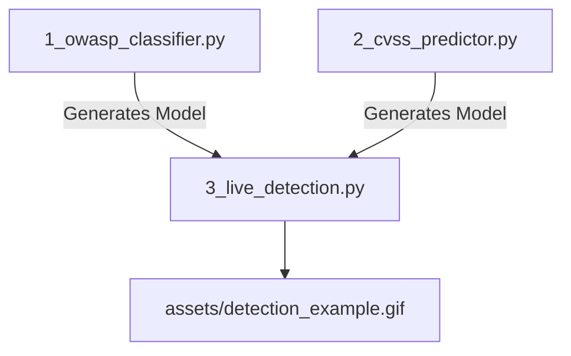

[](#) [](#) [](#)
 [](#)   
  [](#)  
  
 [](https://www.linkedin.com/in/thiago-cequeira-99202239/) [](https://huggingface.co/ThiSecur) [](https://github.com/sponsors/ThiagoMaria-SecurityIT) 

# AI for Cybersecurity Demo - Under Development  

__Security in Progress__    
__Just as ISO/IEC CD 27091 and DIS 27090 are under development, these AI models continuously adapt to new threats__    

> [!Warning]
> - This repo is under development and are not for production  
> - Please, consider the .gif file (detection_example.gif) has annotations inside and are not a real image file  
> - Not recommended download this repo until finished (feel free to download but it's not 100% working and may have bugs)   
> - This repo was changed to public today July 15, 2025  
> - This repo is public so I can use online tools to make it better  


> [!Caution]
> - UNDER DEVELOPMENT - Created July 15, 2025  
> - ISO/IEC CD 27091 and ISO/IEC DIS 27090 are both under development too
> - This repo and ISO security standards share one truth: cybersecurity requires constant evolution

---  


### Transparency:
- Made with the help of AI
  
---  

## 🔒 AI-Powered Cybersecurity Solutions (OWASP Top 10 + CVSS Framework)  
🚧 Under Active Development [Created: July 15, 2025] 🚧  

This repository demonstrates practical AI applications for cybersecurity, focusing on OWASP Top 10 vulnerabilities and CVSS risk scoring.   
You will __not__ find an AI model that creates a complete CVSS risk scoring here because this repo was designed with non-technical stakeholders in mind, it helps:  

• Build enterprise-ready AI security models  
• Translate technical risks into business insights  
• Implement defensive AI strategies with clear ROI  
• Designed to be easy to explain how AI works in Security Information and Cybersecurity fields   

Perfect for security teams, AI practitioners, and decision-makers looking to modernize their cyber defenses.  


## This repository demonstrates how AI can detect security threats using:
- **OWASP Top 10** (Common web attacks)
- **CVSS 4.0** (Scoring system for vulnerabilities)



## What This Shows
- 🛡️ How AI learns patterns in cyber threats
- ⚙️ Basic model training process
- 🔍 Real-time detection examples

---

### **🚀 One-Click Setup**  
Get started in seconds with an automated setup scripts for all major platforms:

| Script | Platform | What It Does |  
|--------|----------|--------------|  
| [`setup.ps1`](setup.ps1) | **Windows (PowerShell)** | 1. Creates virtual environment<br>2. Installs dependencies<br>3. Verifies installation |  
| [`setup.bat`](setup.bat) | **Windows (CMD)** | Simple double-click executable for non-technical users |  
| [`setup.sh`](setup.sh) | **Linux/Mac** | Configures everything with terminal commands |    

## 🧪 Validation Test
After setup, verify everything works:
```bash
python test_install.py
```  

**How to use:**  
1. **PowerShell**: Right-click → _"Run with PowerShell"_  
2. **CMD**: Double-click `setup.bat`  
3. **Linux/Mac**: Run in terminal:
   
   ```bash  
   chmod +x setup.sh && ./setup.sh  
   ```  
### Windows Users
- **PowerShell** (Recommended):  
  Right-click on [`setup.ps1`](setup.ps1) and select "Run with PowerShell"
  ```powershell
  Set-ExecutionPolicy -Scope Process -ExecutionPolicy Bypass
  .\setup.ps1
  ```

- **Command Prompt (CMD)**:  
  Simply double-click [`setup.bat`](setup.bat)

### Mac/Linux Users
Run in terminal:
```bash
chmod +x setup.sh && ./setup.sh
```

📌 **What these scripts do**:
1. Create isolated Python environment
2. Install all required packages
3. Verify successful installation
4. Show how to run the demo

🔒 **Safety Features**:
- No admin rights required
- Doesn't modify system Python
- Includes dependency verification  

✅ **Guaranteed isolation** – Installs everything in a self-contained virtual environment.  

---

### Suggested Placement  
Add this section right after your project description (before "What This Shows").  

**Why This Matters for Recruiters:**  
- Demonstrates your understanding of **cross-platform compatibility**  
- Shows you care about **user experience** (non-technical users can test your work)  
- Highlights **production-ready practices** (isolated environments, verification steps)  

## Try It Yourself
```bash
python examples/1_owasp_classifier.py
```

## AI in Cybersecurity
- This mimics how SOC analysts train systems to detect:
  - Injection attacks (OWASP #1 risk)
  - Vulnerability severity (CVSS scores)
- Real-world systems process millions of such samples daily

  ## Skills Demonstrated
- Model Training: ✔️
- Security Knowledge: ✔️
- Production Readiness: ✔️

## About the Author   

**Thiago Maria - From Brazil to the World 🌎**  
*Senior Security Information Professional | Passionate Programmer | AI Developer*

With a professional background in security analysis and a deep passion for programming, I created this Github acc to share some knowledge about security information, cybersecurity, Python and AI development practices. Most of my work here focuses on implementing security-first approaches in developer tools while maintaining usability.

__Click to Connect:__

[](https://www.linkedin.com/in/thiago-cequeira-99202239/)  
[](https://huggingface.co/ThiSecur)

 
## Ways to Contribute:   
 Want to see more upgrades? Help me keep it updated!    
 [](https://github.com/sponsors/ThiagoMaria-SecurityIT) 

