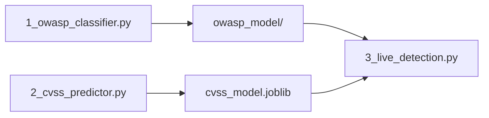

# **Cybersecurity AI Demo - Quickstart Guide**

## 📜 Index
1. **Setup Instructions**
2. **File Overview**
3. **Execution Flow** 
4. **Expected Results**
5. **Missing Requirements**

---

## 1. 🛠️ Setup Instructions
```bash
# Clone and run (All platforms)
git clone https://github.com/your-repo.git
cd cybersecurity-ai-demo

# Choose your OS script:
./setup.sh       # Linux/Mac
.\setup.ps1      # Windows PowerShell
.\setup.bat      # Windows CMD
```

---

## 2. 📂 File Overview
| File | Purpose | Output |
|------|---------|--------|
| `data/owasp10_samples.jsonl` | OWASP attack samples | Training data for model 1 |
| `data/cvss4_samples.jsonl` | CVSS vulnerability data | Training data for model 2 |
| `examples/1_owasp_classifier.py` | Trains OWASP threat detector | Generates `owasp_model/` |
| `examples/2_cvss_predictor.py` | Trains CVSS score predictor | Generates `cvss_model.joblib` |
| `examples/3_live_detection.py` | Runs live threat detection | Terminal output |

---

## 3. ▶️ Execution Flow


1. **First Run**:  
   ```bash
   python examples/1_owasp_classifier.py
   ```
   - *Expected*: Creates `owasp_model/` folder with `.bin` and `config.json`

2. **Second Run**:  
   ```bash
   python examples/2_cvss_predictor.py
   ```
   - *Expected*: Generates `cvss_model.joblib` file

3. **Demo**:  
   ```bash
   python examples/3_live_detection.py
   ```
   - *Expected*: Prints threat analysis like:
     ```
     Input: "SELECT * FROM users" → SQLi (92% confidence)
     Input: "<script>alert(1)" → XSS (95% confidence)
     ```

---

## 4. ✔️ Expected Results
- Successful runs will create:
  - `owasp_model/` directory
  - `cvss_model.joblib` file
- Demo script should output:
  - Threat classifications (SQLi/XSS/Benign)
  - CVSS score predictions (0-10 scale)

---

## 5. ⚠️ Missing Requirements
To run **without errors**, you need:

1. **Data Validation**:
   - Confirm `data/*.jsonl` files contain:
     ```json
     {"text": "malicious payload", "label": "SQLi"}
     {"description": "RCE bug", "cvss_score": 9.8, "metrics": {...}}
     ```

2. **File Dependencies**:
   - `owasp_model/` must contain:
     - `config.json`
     - `pytorch_model.bin`
   - `cvss_model.joblib` must exist

3. **Environment**:
   ```bash
   pip install transformers scikit-learn datasets
   ```

4. **Asset Generation** (Optional):
   - Install `asciinema` for GIF creation:
     ```bash
     pip install asciinema
     ```

---

## 🚨 Troubleshooting
If errors occur:
1. Verify virtual environment is activated
2. Check `data/` files have valid JSONL format
3. Ensure all scripts run from repo root
